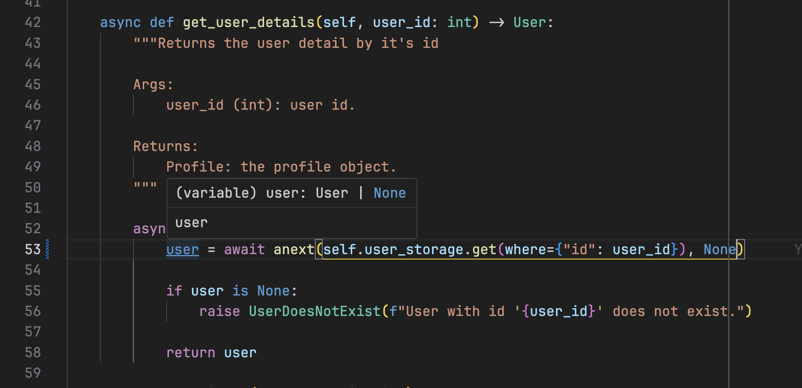

# SOLID sold

The `solid_sold` package provides a generic implementation of the Repository pattern in Python, aimed at creating a flexible and robust data access layer for your applications.

## Key Benefits

1. **Rapid Development**: Focus on your business logic from the start, without worrying about database-specific details.
2. **Type Safety**: Leverage generics for type safety. This ensures you never forget to handle `None` values or other specific return types.
3. **IDE Integration**: Full support for mypy and IDE autocompletion, enhancing type checking and developer experience.
4. **Database Agnostic**: Abstract design allows switching databases without altering business logic.
5. **Error Prevention**: Strong typing catches potential issues during development, reducing runtime errors.

## Components Overview

### AbstractStorage

The `AbstractStorage` class is the base for repository implementations, providing:

- Abstract CRUD methods (`get`, `create`, `delete`, `update`).
- Type inference using Python's typing system.
- Generic parameters for entities, updates, and predicates, offering great flexibility.

### AbstractTransactionalStorage

`AbstractTransactionalStorage` extends `AbstractStorage` with transactional support:

- Context manager for transaction handling (`async with` syntax).
- Automated commit and rollback management.
- Thread-safe transaction tracking with `ContextVar`.

## Usage Example

Define your entity model, such as a simple dataclass, Pydantic model, or another preferred format:

```python
from dataclasses import dataclass

@dataclass
class User:
    email: str
    id: int | None = None
    is_active: bool = False
```

Define an update model for selective updates using `TypedDict`:

```python
from typing import NotRequired, TypedDict

class UserUpdate(TypedDict):
    id: NotRequired[int]
    username: NotRequired[str]
    email: NotRequired[str]
    first_name: NotRequired[str]
    last_name: NotRequired[str]
    is_active: NotRequired[bool]
```

Create a predicate model for filtering entities:

```python
class UserPredicate(TypedDict):
    id: NotRequired[int]
    username: NotRequired[str]
    email: NotRequired[str]
    first_name: NotRequired[str]
    last_name: NotRequired[str]
    is_active: NotRequired[bool]
```

Create a storage for your entity:

```python
from solid_sold.base import AbstractStorage

class UserStorage(AbstractStorage[User, UserUpdate, UserPredicate]):
    ...
```

Let’s create our first service with get_user_details method that simply returns the user by its id:

```python
class UserService:
    def __init__(
        self,
        user_storage: UserStorage,
        transaction: AbstractTransactionalContext,
    ) -> None:
        self.user_storage = user_storage
        self.transaction = transaction

    async def get_user_details(self, user_id: int) -> User:
        """Returns user details by ID."""
        async with self.transaction:
            user = await anext(self.user_storage.get(where={"id": user_id}))

            if user is None:
                raise UserDoesNotExist(f"User with ID '{user_id}' does not exist.")

            return user
```

This class is still generic, but it’s already useful even though it doesn't have a specific database implementation. The idea here is to focus implementing our business logic without focusing on specific database implementation while benefiting from type hinting:





A complete working example with SQLite support can be found in [examples/user](examples/user).

Running sqlite example:

```bash
pip install -e ."[dev]"
python -m examples.user.sqlite
```

## Contributing

Contributions are welcome! Please submit a Pull Request.

## License

This project is licensed under the MIT License - see the [LICENSE](LICENSE) file for details.
